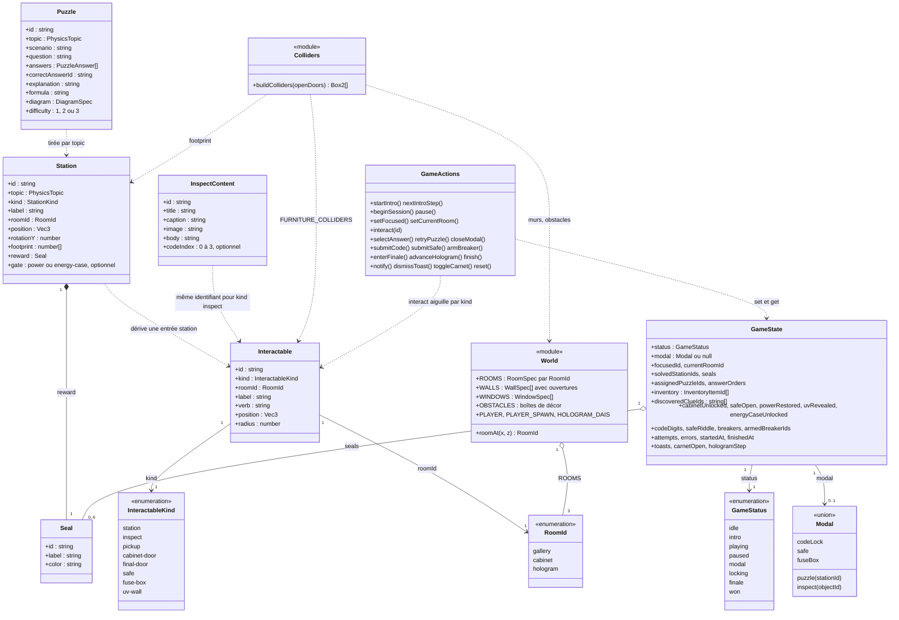
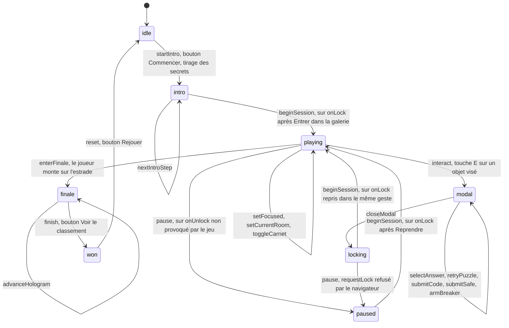
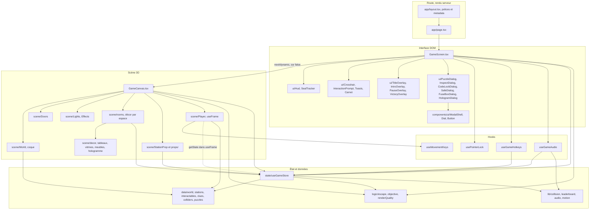
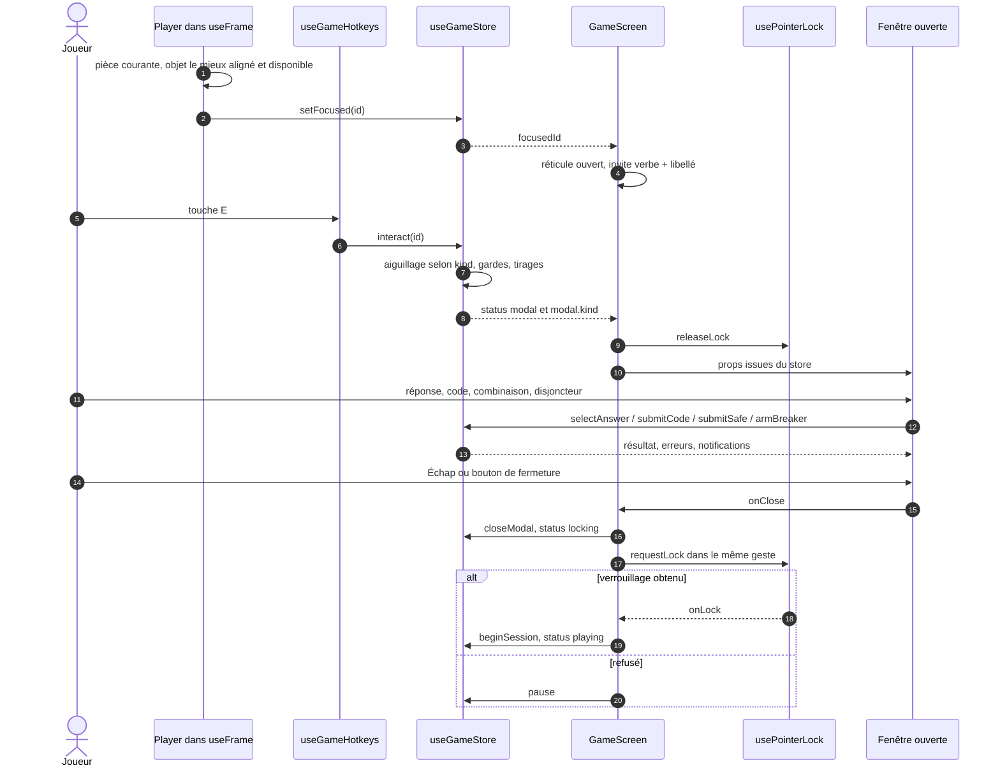

# Architecture

Physics Escape est un escape game 3D à la première personne : Next.js 16 en App
Router, React 19, three.js via React Three Fiber, Zustand pour l'état.

Le code est fonctionnel : il n'y a pratiquement pas de `class`. Le diagramme de
classe ci-dessous décrit donc le **modèle de domaine** (les types et interfaces
de `src/types/game.ts`, l'état du store, les catalogues de données) et les
relations entre modules, et non une hiérarchie objet.

---

## 1. Modèle de domaine

### Invariants qui ne se lisent pas dans le graphe

- **Six postes, six sceaux, trois espaces.** Quatre postes dans la galerie,
  deux dans le cabinet. `TOTAL_SEALS = STATIONS.length` et la porte finale
  s'ouvre quand `seals.length >= TOTAL_SEALS`.
- **Deux postes sont conditionnés** par `Station.gate` : `power` (le banc
  d'Ampère attend `powerRestored`), `energy-case` (la piste de Joule attend la
  clé de la vitrine, qui la déverrouille au premier passage).
- **Les secrets de la partie** (`codeDigits`, `safeRiddle`, `breakers`) sont
  tirés dans `startIntro`, après un geste utilisateur : ils ne sont donc
  jamais rendus côté serveur et ne peuvent pas diverger à l'hydratation.
- **`codeDigits` est ordonné chronologiquement** (Archimède, Galilée, Newton,
  Curie) ; `InspectContent.codeIndex` désigne le rang du savant, et le carnet
  affiche les chiffres dans l'ordre de découverte, pas dans l'ordre du code.
- **Une seule fenêtre à la fois.** `status === "modal"` implique
  `modal !== null`, et `closeModal` remet les deux à zéro ensemble.
- **La question est tirée à l'ouverture du poste** et mémorisée dans
  `assignedPuzzleIds` ; l'ordre des propositions dans `answerOrders`.
- **`errors` compte toutes les fautes** : mauvaise réponse, code faux,
  combinaison fausse, disjoncteur mal réarmé. `attempts` ne compte que les
  réponses aux postes et sert à la précision de l'écran de fin.
- **`footprint` et les boîtes de collision sont en repère monde**, jamais
  tournées par `rotationY`.
- **Un objet n'est visé que s'il a encore quelque chose à offrir** :
  `isInteractableAvailable` écarte un poste résolu, une porte ouverte, un
  coffre vide, un tableau électrique déjà réarmé, et n'expose le mur UV qu'au
  porteur de la lampe.

---

## 2. Machine d'état de la partie

Gardes vérifiées dans `useGameStore.ts` :

- `beginSession` n'agit que depuis `intro`, `paused` ou `locking`, et fixe
  `startedAt` au premier passage.
- `interact` exige `playing`, un objet connu et disponible, puis aiguille selon
  `kind` : un poste ouvre sa question (ou refuse avec une notification si sa
  condition n'est pas remplie), un objet ouvre sa fiche et note l'indice, le
  bureau donne la lampe UV, la porte ouvre le cadenas, le coffre et le tableau
  électrique ouvrent leur fenêtre (le tableau exige le fusible), le mur UV
  révèle et ouvre le message.
- `submitCode`, `submitSafe` et `armBreaker` comptent une erreur en cas
  d'échec ; `armBreaker` remet aussi les disjoncteurs à zéro.
- `enterFinale` n'agit que depuis `playing` et fixe `finishedAt`.
- `reset` repart de l'état initial ; les secrets sont retirés au prochain
  `startIntro`.

---

## 3. Architecture des composants

Points de lecture :

- La salle et le schéma d'une question sont deux `<Canvas>` distincts. Dès
  qu'un écran recouvre la salle (titre, introduction, pause, fenêtre,
  victoire), `GameCanvas` passe en `frameloop="demand"`.
- Le cabinet et la salle de l'hologramme sortent du rendu et de la passe
  d'ombre tant que leur porte est close. `<Preload all />` compile pourtant
  leurs shaders et envoie leurs textures dès le chargement : l'ouverture d'une
  porte ne provoque pas d'à-coup.
- `PerformanceMonitor` mesure la cadence réelle et, via
  `logic/renderQuality`, abaisse la densité de pixels puis l'anticrénelage du
  post-traitement sur les machines modestes.
- `Player` ne s'abonne pas au store : il le lit par `getState()` dans
  `useFrame`, calcule la pièce courante, l'objet visé (distance au sol et angle
  en trois dimensions) et le déclenchement de la finale sur l'estrade.
- Le décor de chaque espace est un composant de `scene/rooms` qui s'abonne aux
  seuls booléens qui le concernent (courant, coffre, message UV).
- Les textes gravés en 3D (cartels, enseignes, message UV) sont des
  `CanvasTexture` produites par `useTextTexture`, avec les polices du site.
- `debug.ts` expose le store, la caméra et la scène sur `window` en
  développement, pour les parcours automatisés.

---

## 4. Flux d'une interaction

---

## 5. Tableau des modules

| Dossier                                 | Rôle                                                              | Dépendances autorisées                                                     | Interdits                              |
| --------------------------------------- | ----------------------------------------------------------------- | -------------------------------------------------------------------------- | -------------------------------------- |
| `src/app`                               | Route unique : `layout`, `page`, `error`, `not-found`.            | `features/game/components/GameScreen`                                      | Le store, les données, three.js        |
| `src/components/ui`                     | Primitives partagées : `Button`, `Eyebrow`, `ModalShell`, `Dial`. | `lib`, `hooks`                                                             | Le domaine, le store, three.js         |
| `src/hooks`                             | Hooks génériques : piège à focus, classement.                     | `lib`, React                                                               | Le domaine                             |
| `src/features/game/components`          | `GameScreen` compose, `GameCanvas` ouvre le `<Canvas>`.           | `state`, `data`, `logic`, `hooks`, sous-dossiers, `lib`                    | -                                      |
| `src/features/game/components/scene`    | Coque, portes, lumières, joueur, postes, décor.                   | `data`, `state`, `hooks`, `lib`, `types`, `debug`                          | `components/ui`, `components/diagrams` |
| `src/features/game/components/diagrams` | Schémas 3D des questions.                                         | `types`, `lib`, `hooks/useFocusTrap`                                       | Le store, `data`, `components/scene`   |
| `src/features/game/components/ui`       | HUD, carnet, notifications, overlays, fenêtres.                   | `components/ui`, `data`, `logic`, `hooks`, `lib`, `diagrams/DiagramViewer` | `components/scene`, three.js           |
| `src/features/game/data`                | Monde, postes, interactables, textes, collisions, questions.      | `types`, `lib/collision`                                                   | Les composants, le store, React        |
| `src/features/game/logic`               | Tirages des énigmes, objectif, formatage.                         | `types`, `lib/shuffle`, `data/stations`                                    | Les composants, le store               |
| `src/features/game/hooks`               | Clavier, interaction, Pointer Lock, son.                          | `state`, `lib`, React, drei (type)                                         | Les composants, `data`                 |
| `src/features/game/state`               | Store Zustand : état, actions, sélecteurs.                        | `data`, `logic`, `lib`, `types`                                            | Les composants, three.js, React        |
| `src/lib`                               | Logique pure : collisions, classement, audio, mouvement, `cn`.    | `clsx`, `tailwind-merge`, `types`                                          | Tout le domaine                        |
| `src/types`                             | Modèle de domaine partagé.                                        | Aucun import                                                               | Tout le reste                          |

### Écarts connus

- `DiagramKind` reste un alias de `string` et `DIAGRAM_SCENES` un `Record` à
  clés libres : rien à la compilation ne garantit qu'un `diagram.kind`
  corresponde à une scène enregistrée, d'où la garde « Schéma indisponible ».
- `pickPuzzle` exclut les questions déjà tirées tous thèmes confondus ; le
  résultat est correct puisque les identifiants sont uniques.
- Les positions du décor (`scene/rooms`) et celles des interactables
  (`data/interactables.ts`) sont déclarées à deux endroits : un objet déplacé
  doit l'être dans les deux.
