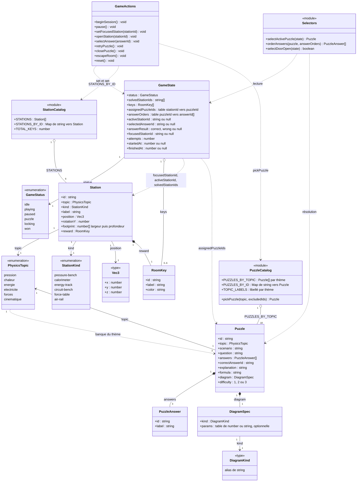
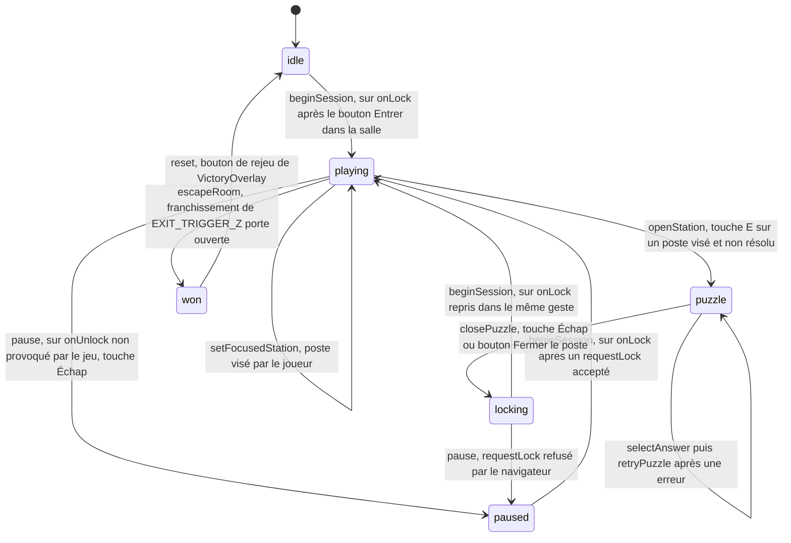
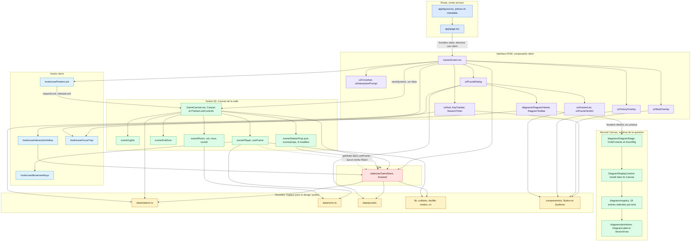
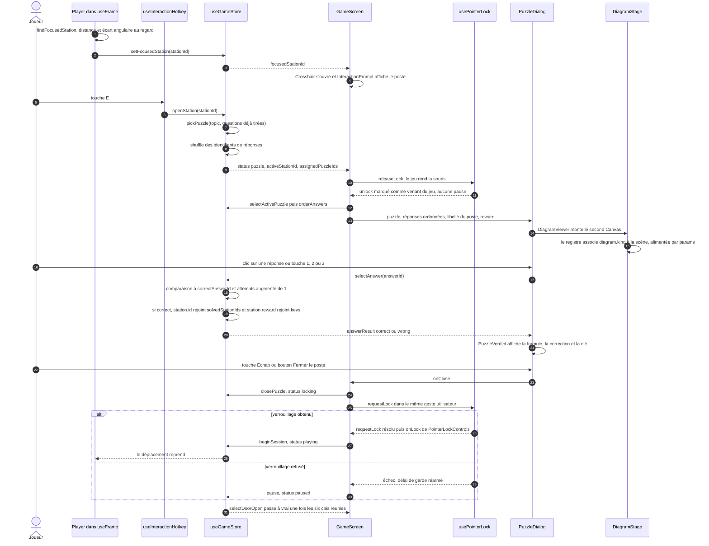

# Architecture

Physics Escape est un escape game 3D à la première personne : Next.js 16 en App
Router, React 19, three.js via React Three Fiber, Zustand pour l'état.

Le code est fonctionnel : il n'y a pratiquement pas de `class`. Le diagramme de
classe ci-dessous décrit donc le **modèle de domaine** (les types et interfaces
de `src/types/game.ts`, l'état du store, les catalogues de données) et les
relations entre modules, et non une hiérarchie objet.

---

## 1. Modèle de domaine

`StationCatalog` correspond à `src/features/game/data/stations.ts`,
`PuzzleCatalog` à `src/features/game/data/puzzles/index.ts`, `GameState`,
`GameActions` et `Selectors` à `src/features/game/state/useGameStore.ts`. Les
deux champs notés « table » sont des `Record<string, string>` et
`Record<string, string[]>`, et `footprint` est le tuple
`[width: number, depth: number]`.

### Invariants qui ne se lisent pas dans le graphe

- **Une station par thème.** `STATIONS` contient six entrées couvrant les six
  valeurs de `PhysicsTopic`, et chaque thème compte trois questions de
  difficultés 1, 2 et 3, soit dix-huit questions au total. Aucun type n'impose
  cette bijection : c'est la donnée qui la garantit.
- **La question est tirée à l'ouverture du poste**, pas au démarrage de la
  partie. `openStation` appelle `pickPuzzle(station.topic, ...)` puis mémorise
  le résultat dans `assignedPuzzleIds` : une mauvaise réponse ne change donc
  jamais l'énoncé quand le joueur revient sur le même poste. Le tirage restant
  côté client, il ne peut pas provoquer de divergence d'hydratation.
- **L'ordre des propositions est tiré au même instant** et rangé dans
  `answerOrders`, indexé par identifiant de question et non par identifiant de
  station. `orderAnswers` est une fonction pure et non un sélecteur Zustand :
  elle construit un tableau neuf, ce qui déclencherait un rendu à chaque
  notification du store si elle était abonnée.
- **La clé est attachée à la station, jamais à la question.**
  `Station.reward` est fixe : quel que soit le tirage, un poste délivre
  toujours la même `RoomKey`, de la même couleur, celle du socle et de la
  pastille du HUD.
- **Le nombre de clés suit le nombre de stations.**
  `TOTAL_KEYS = STATIONS.length`, et `selectDoorOpen` compare
  `solvedStationIds.length` à cette constante : ajouter un poste renforce
  automatiquement la condition de sortie.
- **`Puzzle.topic` duplique `Station.topic`.** La cohérence tient au seul fait
  que `pickPuzzle` reçoit `station.topic` en argument ; le typage ne la vérifie
  pas.
- **`DiagramKind` est un simple alias de `string`** et le registre
  `DIAGRAM_SCENES` est un `Record<string, ...>` : rien à la compilation ne
  garantit qu'un `diagram.kind` corresponde à une scène enregistrée.
  `DiagramStage` retombe sur un message « Schéma indisponible ».
- **`footprint` est exprimée en repère monde**, jamais tournée par
  `rotationY` : elle alimente les collisions alignées sur les axes, tandis que
  `rotationY` n'oriente que le modèle 3D.
- **`keys` et `solvedStationIds` progressent ensemble** : `selectAnswer` les
  met à jour dans le même `set`, ils ont donc toujours la même longueur.

---

## 2. Machine d'état de la partie

Chaque transition porte l'action du store qui la produit et l'événement qui
l'appelle. Le verrouillage du pointeur est piloté par l'interface : c'est
l'événement `onLock` de `PointerLockControls` qui appelle `beginSession`, et
l'événement `onUnlock` qui décide, ou non, d'appeler `pause`.

Gardes vérifiées dans `useGameStore.ts` :

- `beginSession` est ignorée depuis `won` et `puzzle`, et fixe `startedAt` au
  premier passage seulement : la pause ne remet pas le chronomètre à zéro.
- `pause` n'agit que depuis `playing` ou `locking`. Un `onUnlock` provoqué par
  le jeu lui-même est filtré en amont par `usePointerLock.handleUnlockEvent`,
  qui renvoie `true` dans ce cas : c'est ce qui empêche l'écran de pause
  d'apparaître à l'ouverture d'une question ou de l'écran de victoire.
- `openStation` exige `status === "playing"`, une station connue de
  `STATIONS_BY_ID`, non présente dans `solvedStationIds`, et une question
  trouvée.
- `selectAnswer` et `retryPuzzle` ne modifient jamais `status` : la boîte de
  dialogue reste dans `puzzle`. `selectAnswer` est refusée si un
  `answerResult` est déjà posé, `retryPuzzle` n'agit que sur un résultat
  `wrong`.
- `closePuzzle` n'agit que depuis `puzzle` et passe par `locking` plutôt que
  par `paused` : `GameScreen.handleClosePuzzle` enchaîne immédiatement sur
  `requestLock` dans le geste utilisateur qui a fermé le poste, et ne bascule
  en `paused` que si le navigateur refuse.
- `escapeRoom` est appelée depuis la boucle de rendu de `Player`, qui sort tôt
  si `status !== "playing"` : la transition ne peut donc venir que de
  `playing`. Elle est idempotente et remet `focusedStationId` à `null`.
- `reset` n'a aucune garde et repart de l'état initial, mais elle n'est câblée
  que sur l'écran de victoire.
- L'état `locking` n'affiche aucune surcouche et fige le déplacement, puisque
  `Player` n'avance que dans `playing` : il ne dure que le temps de la reprise
  du pointeur.

---

## 3. Architecture des composants

`app/page.tsx` est un composant serveur qui ne fait que composer `GameScreen`,
premier composant client de l'arbre. `GameScreen` importe `GameCanvas` par
`next/dynamic` avec `ssr: false`, le rendu WebGL ne pouvant pas être prérendu.
Deux frontières `<Canvas>` coexistent : celle de la salle et celle, montée à la
demande, du schéma de la question.

Points de lecture :

- La salle et le schéma sont deux `<Canvas>` distincts. Quand une modale est
  ouverte, `GameCanvas` passe en `frameloop="demand"` et rend le GPU au
  schéma.
- Les contextes React ne franchissent pas la frontière du moteur de rendu
  three.js : `DiagramDisplayProvider` est donc monté **à l'intérieur** du
  `<Canvas>` du schéma, ce qui permet à `DiagramLabel` de s'effacer seul sans
  que les dix-huit scènes aient à gérer l'affichage des légendes.
- `Player` ne s'abonne pas au store : il le lit par `useGameStore.getState()`
  dans `useFrame`, ce qui évite tout rendu React à soixante images par
  seconde. Seuls `StationProp`, `GameCanvas` et les composants DOM s'abonnent,
  et uniquement aux booléens qui les concernent.
- `DiagramViewer` monte deux fois `DiagramStage` selon l'état d'agrandissement,
  les deux cadres partageant le même `layoutId` : le cadre grandit d'un seul
  mouvement.

---

## 4. Flux de données d'une question

Après une mauvaise réponse, `retryPuzzle` efface `selectedAnswerId` et
`answerResult` sans quitter `puzzle` ni pénaliser le joueur, mais le compteur
`attempts` a déjà été incrémenté : c'est lui qui alimente le taux de réussite
de l'écran de victoire.

---

## 5. Tableau des modules

| Dossier | Rôle | Dépendances autorisées | Interdits |
| --- | --- | --- | --- |
| `src/app` | Route unique : `layout`, `page`, `error`, `not-found`. Polices, metadata et viewport. | `features/game/components/GameScreen` | Le store, les données, three.js |
| `src/components/ui` | Primitives du design system partagées : `Button`, `Eyebrow`. | `lib/cn` | Le domaine, le store, three.js |
| `src/features/game/components` | Composition de l'écran : `GameScreen` assemble scène, HUD et modales, `GameCanvas` ouvre le `<Canvas>`. | `state`, `data`, `hooks`, les trois sous-dossiers de composants, `lib` | - |
| `src/features/game/components/scene` | Salle, porte, éclairage, joueur, postes et leurs six modèles dans `props/`. Matériaux dans `materials.ts`. | `data`, `state`, `hooks`, `lib/collision`, `types` | `components/ui`, `components/diagrams` |
| `src/features/game/components/diagrams` | Schémas 3D des questions : `DiagramViewer`, `DiagramStage`, le registre `registry.ts`, les scènes de `scenes/`, les primitives et la palette. | `types`, `lib`, `hooks/useFocusTrap`, `registry`, `palette` | Le store, `data`, `components/scene` |
| `src/features/game/components/ui` | Interface DOM : HUD, réticule, invite, dialogue de poste, correction, overlays. | `components/ui`, `data` pour les libellés, le type `AnswerResult` du store, `lib`, `diagrams/DiagramViewer` | `components/scene`, three.js |
| `src/features/game/data` | Contenu : les six postes et leurs clés, la géométrie de la salle et ses collisions, la banque de questions par thème. | `types`, `lib/collision` | Les composants, le store, React |
| `src/features/game/hooks` | Clavier de déplacement, raccourci d'interaction, Pointer Lock, piège à focus. | `state`, React | Les composants, `data` |
| `src/features/game/state` | Store Zustand : état, actions et fonctions de sélection. | `data`, `lib/shuffle`, `types` | Les composants, three.js, React |
| `src/lib` | Logique pure et sans effet de bord : collisions, mélange, vocabulaire de mouvement, `cn`. | `clsx`, `tailwind-merge` uniquement | Tout le domaine |
| `src/types` | Modèle de domaine partagé. | Aucun import | Tout le reste |

### Écarts constatés

Le code mort relevé lors de la rédaction de ce document a été retiré depuis :
`TRANSITION.reveal`, les primitives `Panel` et `Hairline`, et l'export de
`PUZZLES`. Restent deux points ouverts.

- `hooks/usePointerLock.ts` importe le type `PointerLockControlsHandle` depuis
  `components/GameCanvas.tsx` : une dépendance de `hooks` vers `components`,
  contraire au sens des couches. Elle est limitée à un `import type`, mais elle
  gagnerait à vivre dans `types/` ou dans un module dédié.
- `DiagramKind` reste un alias de `string` et `DIAGRAM_SCENES` un
  `Record` à clés libres : rien à la compilation ne garantit qu'un
  `diagram.kind` corresponde à une scène enregistrée, d'où la garde
  d'exécution « Schéma indisponible » de `DiagramStage`. Une union dérivée du
  registre supprimerait ce risque.
- `pickPuzzle` exclut `Object.values(assignedPuzzleIds)`, c'est-à-dire les
  questions tirées **tous thèmes confondus**, alors que le tirage se fait dans
  un seul thème. Le résultat est correct puisque les identifiants sont uniques,
  mais l'intention se lirait mieux avec une exclusion restreinte au thème.
